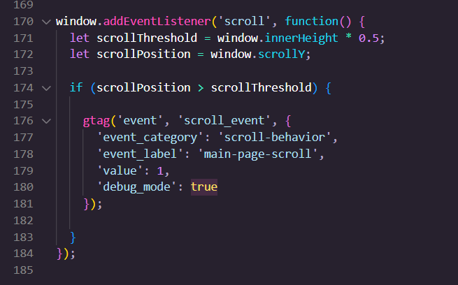
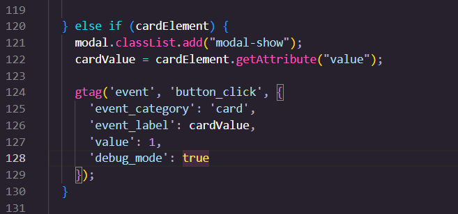
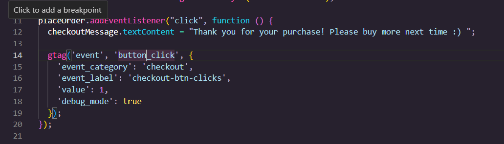
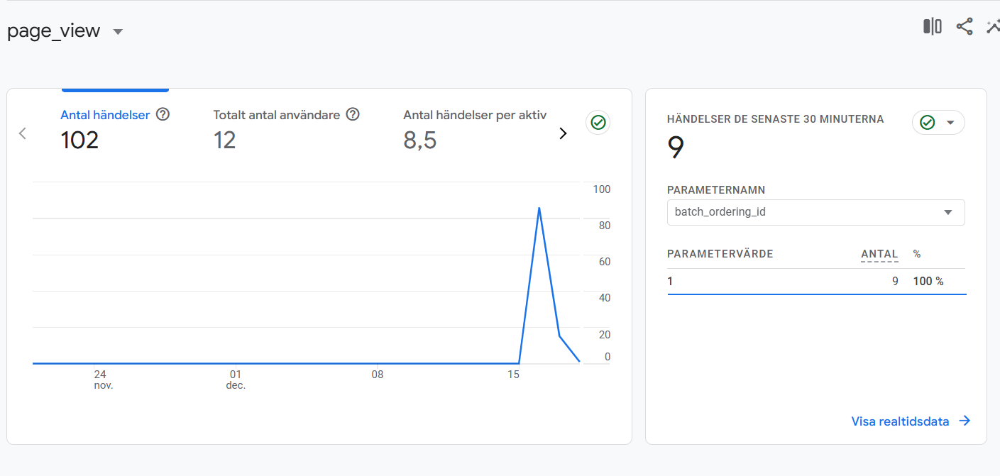
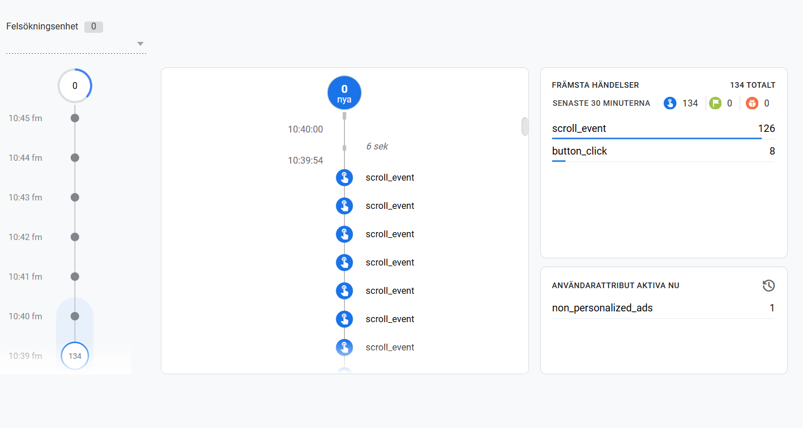
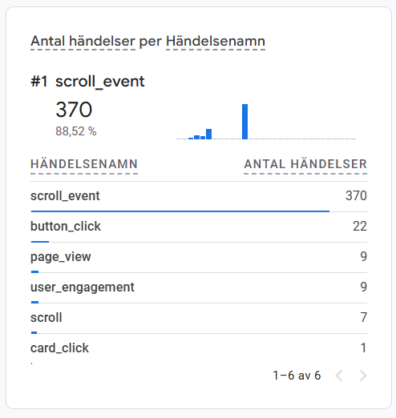
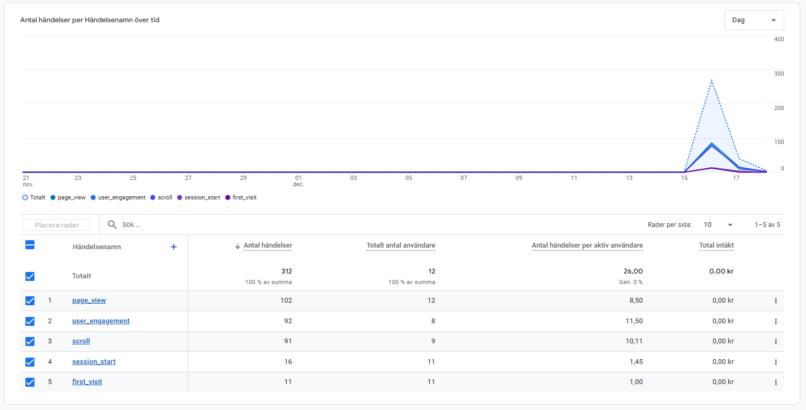

# Team 1

- Felix Olsson-Stenersjö
- Sara J. Pallander
- Moa Sjögren
- Mladen Kovacic
- Simon Kaneborn

## Om projektet

Världens bästa webshop B) (gleeple zorp approved)

Featured som #1 website i ZeepZorp magazine

"Galorp zeep gleerp gorp 5/5" - Zarpo Gloop

\*Ändrad till 'card_click'

## Reflektioner:

### Möjligheter med händelsespårning:

- Spåra användares beteenden för att se var deras intressen ligger.
- Se vilka produkter som är mest populära och se till att de allitd finns i lager.
- Se hur många som faktiskt slutför ett köp, och hur många som lämnar kundvagnen.
- Studera beteenden för att se vad som kan förbättras med hemsidan.
- Riktad reklam till användare.

### Begränsningar:

- Möjliga GDPR-intrång
- Svårtolkad data i Google Analytics
